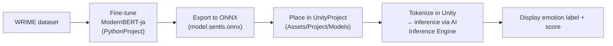

# Fine-tuning an Encoder-only Model & Running It on Unity

[日本語](README.md)

A sample repository that walks through the whole pipeline: fine-tuning a Japanese encoder-only model
([`sbintuitions/modernbert-ja-130m`](https://huggingface.co/sbintuitions/modernbert-ja-130m)) for
**multi-class emotion classification**, exporting it to ONNX, and running **on-device inference in Unity
(AI Inference Engine / Sentis)**.

Article (Japanese): [エンコーダのみのモデルをファインチューニングする - Zenn](https://zenn.dev/edom18/articles/encoder-only-model-ft)

---

## Structure

This repository consists of two projects.

| Directory | Description |
|---|---|
| [`PythonProject/`](PythonProject/README.en.md) | Fine-tuning, evaluation, and ONNX export for emotion classification on the WRIME dataset (managed with uv) |
| `UnityProject/` | Demo app that loads the exported ONNX model and runs text classification in the Unity Editor / on-device |



The model is trained on Plutchik's 8 basic emotions (joy, sadness, anticipation, surprise, anger, fear, disgust,
trust) plus neutral, for a **9-class classification** task.

---

## Quick Start

### 1. Train the model and export to ONNX (Python)

For detailed steps, requirements, and troubleshooting, see [`PythonProject/README.en.md`](PythonProject/README.en.md).
Summary:

```powershell
cd PythonProject
uv sync
uv run python scripts/01_prepare_data.py   # download and prepare WRIME
uv run python scripts/02_train.py          # fine-tune
uv run python scripts/03_evaluate.py       # evaluate
uv sync --extra onnx
uv run python scripts/05_export_onnx.py    # writes model.sentis.onnx / tokenizer.json / id2label.json
```

The exported `model.sentis.onnx` / `tokenizer.json` / `id2label.json` are in the same format as the files
already placed under `UnityProject/Assets/Project/Models/` (copy them there if you want to replace the demo model).

### 2. Run it in Unity

- Open `UnityProject` with Unity **6000.3.15f1**
- Open `Assets/Project/Scenes/SampleScene.unity` and press Play
- Type some text and press the button — the predicted emotion label and score are shown

Required packages (already declared in `Packages/manifest.json` and resolved automatically):

- `com.unity.ai.inference` (AI Inference Engine / Sentis) 2.6.1
- `com.unity.nuget.newtonsoft-json` (for parsing the tokenizer / id2label JSON)

---

## Unity-side implementation notes

- **`SentimentClassifier.cs`**: Loads the ONNX model via `ModelLoader.Load` and runs inference on GPU with `Worker`.
  Feeds `input_ids` / `attention_mask`, reads back `logits`, and picks the label with Softmax + argmax.
- **`UnigramTokenizer.cs`**: A from-scratch C# implementation of the SentencePiece Unigram tokenizer
  (`tokenizer.json`), with no external tokenizer library dependency. Uses Viterbi decoding to find the most
  likely piece segmentation, falling back to byte-level tokens for out-of-vocabulary characters.
- **`ClassiferClient.cs`**: UI layer that wires the input field and button to `SentimentClassifier`.
- Two ONNX variants are exported: `model.onnx` (int64 inputs, general-purpose) and `model.sentis.onnx`
  (int32 inputs, so it can be fed directly into Unity's `Tensor<int>`).

---

## Model / data attribution

- Model: [`sbintuitions/modernbert-ja-130m`](https://huggingface.co/sbintuitions/modernbert-ja-130m) (MIT)
- Data: [WRIME ver2](https://github.com/ids-cv/wrime) (follow the original license/terms when using it)
