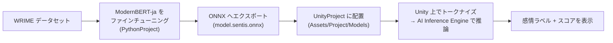

# Encoder-only モデルのファインチューニング & Unity 実機推論デモ

日本語のエンコーダのみモデル（[`sbintuitions/modernbert-ja-130m`](https://huggingface.co/sbintuitions/modernbert-ja-130m)）を
**多クラス感情分類**にファインチューニングし、ONNX へ書き出して **Unity（AI Inference Engine / Sentis）上でオンデバイス推論する**
までを一気通貫で示すサンプルリポジトリです。

解説記事: [エンコーダのみのモデルをファインチューニングする - Zenn](https://zenn.dev/edom18/articles/encoder-only-model-ft)

---

## 構成

本リポジトリは2つのプロジェクトで構成されています。

| ディレクトリ | 内容 |
|---|---|
| [`PythonProject/`](PythonProject/README.md) | WRIME データセットでの感情分類ファインチューニング・評価・ONNX エクスポート一式（uv 管理） |
| `UnityProject/` | 書き出した ONNX モデルを Unity 上で読み込み、実機（エディタ）でテキスト分類を行うデモアプリ |



学習対象は Plutchik の8感情（喜び・悲しみ・期待・驚き・怒り・恐れ・嫌悪・信頼）+ 中立の **9クラス分類**です。

---

## クイックスタート

### 1. モデルの学習 〜 ONNX 書き出し（Python）

詳細な手順・必要環境・トラブルシューティングは [`PythonProject/README.md`](PythonProject/README.md) を参照してください。概要のみ：

```powershell
cd PythonProject
uv sync
uv run python scripts/01_prepare_data.py   # WRIME を取得・整形
uv run python scripts/02_train.py          # ファインチューニング
uv run python scripts/03_evaluate.py       # 評価
uv sync --extra onnx
uv run python scripts/05_export_onnx.py    # model.sentis.onnx / tokenizer.json / id2label.json を出力
```

書き出された `model.sentis.onnx` / `tokenizer.json` / `id2label.json` は、そのまま
`UnityProject/Assets/Project/Models/` に配置済みのものと同じ形式です（差し替える場合はここにコピーしてください）。

### 2. Unity での実行

- Unity **6000.3.15f1** で `UnityProject` を開く
- `Assets/Project/Scenes/SampleScene.unity` を開いて再生
- テキストを入力してボタンを押すと、9クラスの感情ラベルとスコアが表示される

必要パッケージ（`Packages/manifest.json` に定義済み・自動解決）:

- `com.unity.ai.inference`（AI Inference Engine / Sentis）2.6.1
- `com.unity.nuget.newtonsoft-json`（tokenizer / id2label の JSON パース用）

---

## Unity 側の技術的なポイント

- **`SentimentClassifier.cs`**: ONNX モデルを `ModelLoader.Load` → `Worker` で GPU 推論。`input_ids` / `attention_mask` を渡し、`logits` を受け取って Softmax + argmax でラベルを決定する。
- **`UnigramTokenizer.cs`**: 外部トークナイザライブラリに依存せず、SentencePiece の Unigram モデル（`tokenizer.json`）を C# にフルスクラッチ実装。Viterbi 法で最尤のピース分割を求め、語彙外文字は byte-fallback で処理する。
- **`ClassiferClient.cs`**: 入力欄とボタンから `SentimentClassifier` を呼び出す UI 層。
- ONNX は用途別に2種類書き出している: `model.onnx`（int64 入力・汎用）と `model.sentis.onnx`（int32 入力・Unity の `Tensor<int>` にそのまま渡せる）。

---

## モデル・データの出典

- モデル: [`sbintuitions/modernbert-ja-130m`](https://huggingface.co/sbintuitions/modernbert-ja-130m)（MIT）
- データ: [WRIME ver2](https://github.com/ids-cv/wrime)（利用時は原典のライセンス・規約に従うこと）
